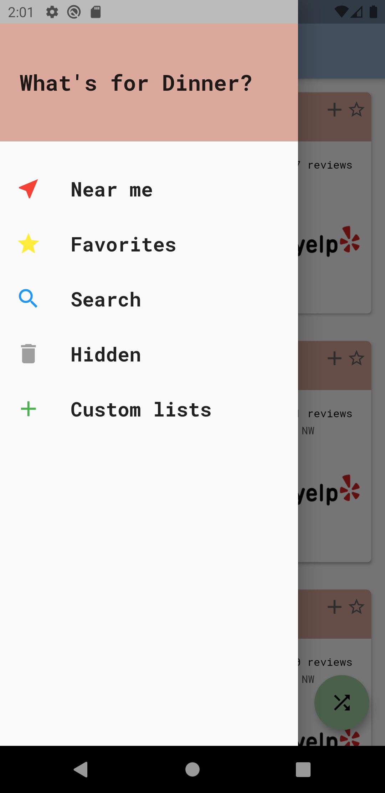

# What's For Dinner?

Flutter app that makes deciding which restaurant to eat at easier. 

## Download

Not yet available

## App Preview

  
   
  
  

## Installation

- Install [Flutter](https://flutter.dev/docs/get-started/install)

- Run `flutter packages get`

- Use `flutter run` command to run in emulator 

## Todos

- [ ] Firebase Integration
- [ ] User Authentication
- [ ] Share lists between users
