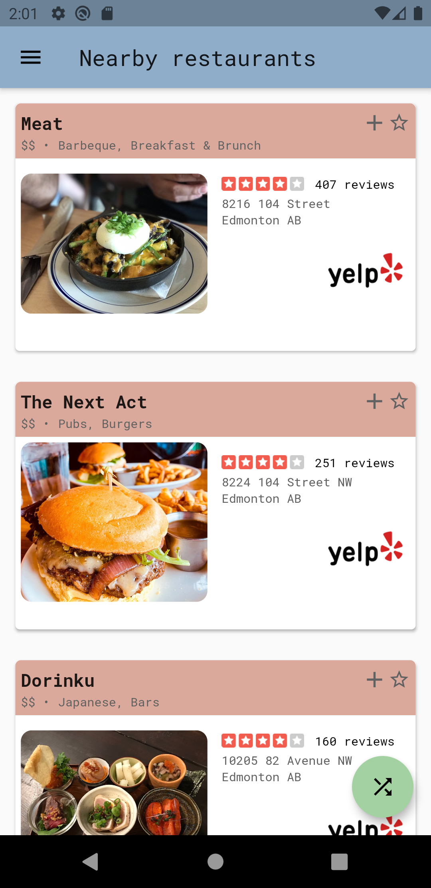
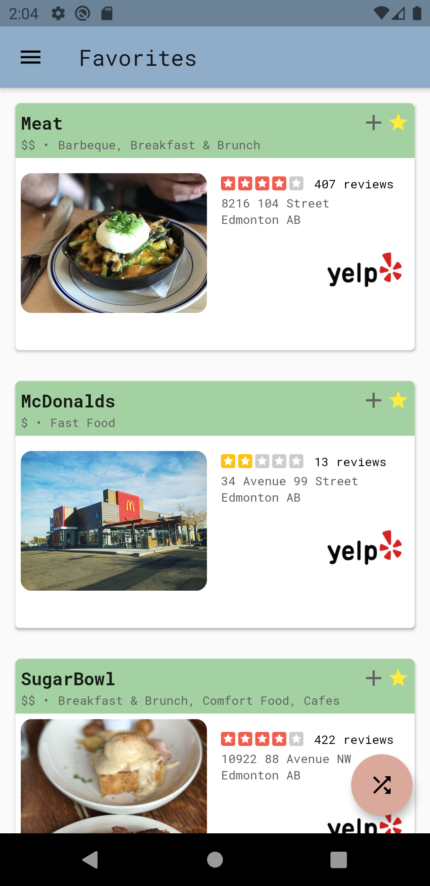
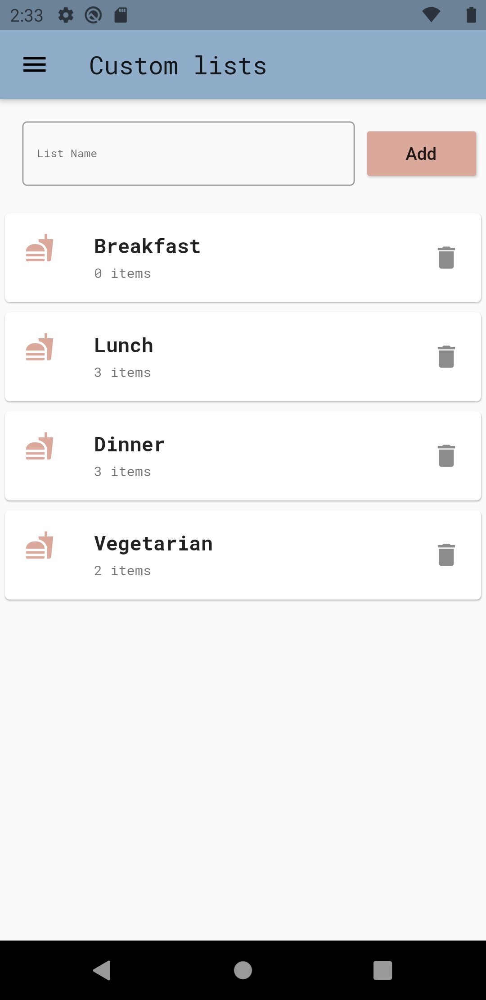

# What's For Dinner?

Flutter app that makes deciding which restaurant to eat at easier. 

## Download

Not yet available

## App Preview

  
   
  

  
  

## Installation

- Install [Flutter](https://flutter.dev/docs/get-started/install)

- Run `flutter packages get`

- Use `flutter run` command to run in emulator 

## Todos

- [x] Firebase Integration
- [x] User Authentication
- [x] Share lists between users
- [ ] Search improvements
- [ ] Dark mode
- [ ] IOS 
- [ ] Improve readme
- [ ] Unit tests